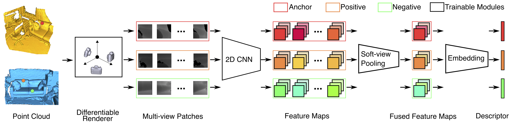

# End-to-End Learning Local Multi-view Descriptors for 3D Point Clouds

By Lei Li, Siyu Zhu, Hongbo Fu, Ping Tan, and Chiew-Lan Tai. (CVPR 2020)

In this work, we propose an end-to-end framework to learn local multi-view descriptors for 3D point clouds. To adopt a similar multi-view representation, existing studies use hand-crafted viewpoints for rendering in a preprocessing stage, which is detached from the subsequent descriptor learning stage. In our framework, we integrate the multi-view rendering into neural networks by using a differentiable renderer, which allows the viewpoints to be optimizable parameters for capturing more informative local context of interest points. To obtain discriminative descriptors, we also design a soft-view pooling module to attentively fuse convolutional features across views. Extensive experiments on existing 3D registration benchmarks show that our method outperforms existing local descriptors both quantitatively and qualitatively.



## Link

[Paper](https://arxiv.org/pdf/2003.05855)

## Citation
```
@InProceedings{Li_2020_CVPR,
    author = {Li, Lei and Zhu, Siyu and Fu, Hongbo and Tan, Ping and Tai, Chiew-Lan},
    title = {End-to-End Learning Local Multi-view Descriptors for 3D Point Clouds},
    booktitle = {The IEEE Conference on Computer Vision and Pattern Recognition (CVPR)},
    year = {2020}
}
```


## Instructions

### Dependencies

- CUDA \& CUDNN

- Python 3.6 or 3.7

- Install packages by
```
pip install -r requirements.txt
```

If you are familiar with Docker, a ``Dockerfile`` is provided in folder ``docker`` for building a [Docker image](https://hub.docker.com/r/craigleili/3dlocalmultiviewdesc/tags?page=1&name=mvdesc) that includes a complete running environment.

### 3DMatch Benchmark

#### Training

Download the 3DMatch RGB-D data via [this link](http://3dmatch.cs.princeton.edu/#rgbd-reconstruction-datasets).

Go to folder ```data/preprocess```. Use the following scripts for preprocessing and generating training data.

- ```fuse_fragments_3DMatch.py``` for generating point cloud fragments from the RGB-D data.
- ```compute_radius.py``` for computing point radius. (May skip it to save time \& space if to use fixed-radius point rendering)
- ```compute_overlap.py``` for finding partially overlapped fragment pairs.
- ```compute_kpt_pairs.py``` for selecting point pairs in overlapped regions for batch-hard training.

Go to folder ```scripts```. Fill the paths in ```configs/ours_3dmatch.yaml``` and run
```
python main_mvdesc.py train configs/ours_3dmatch.yaml
```

A copy of the trained weights is located in ```scripts/ours_3dmatch```.

#### Evaluation

Download the 3DMatch geometric registration benchmark via [this link](https://1drv.ms/u/s!Alg6Vpe53dEDgZIsbH8Vt_J2T1CCMQ?e=QMl1U0). If you use these data in your work, please consider citing [[1]](#references).

Go to folder ```scripts```. Fill the paths in ```configs/ours_3dmatch.yaml``` and then extract the local multi-view descriptors by running
```
python main_mvdesc.py test configs/ours_3dmatch.yaml
```
The extracted descriptors can also be directly downloaded via [this link](https://1drv.ms/u/s!Alg6Vpe53dEDgZIsbH8Vt_J2T1CCMQ?e=QMl1U0).

Compute the recall metric by running ```evaluation/eval_geomreg_3dmatch.sh```.

### ETH Benchmark

Download the ETH benchmark via [this link](https://1drv.ms/u/s!Alg6Vpe53dEDgZIsbH8Vt_J2T1CCMQ?e=QMl1U0). If you use these data in your work, please consider citing [[2, 3]](#references).

Go to folder ```scripts```. Fill the paths in ```configs/ours_eth.yaml``` and then extract the local multi-view descriptors by running
```
python main_mvdesc.py test configs/ours_eth.yaml
```
The extracted descriptors can also be directly downloaded via [this link](https://1drv.ms/u/s!Alg6Vpe53dEDgZIsbH8Vt_J2T1CCMQ?e=QMl1U0).

Compute the recall metric by running ```evaluation/eval_geomreg_eth.sh```.

## References

1. Zeng et al. [3DMatch: Learning Local Geometric Descriptors from RGB-D Reconstructions](http://3dmatch.cs.princeton.edu/). CVPR 2017.
1. Pomerleau et al. [Challenging data sets for point cloud registration algorithms](https://projects.asl.ethz.ch/datasets/doku.php?id=laserregistration:laserregistration). IJRR 2012.
1. Gojcic et al. [The Perfect Match: 3D Point Cloud Matching with Smoothed Densities](https://github.com/zgojcic/3DSmoothNet). CVPR 2019.
1. Liu et al. [Soft Rasterizer: A differentiable renderer for image-based 3d reasoning](https://github.com/ShichenLiu/SoftRas). ICCV 2019.
